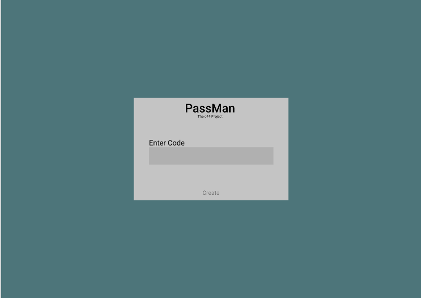
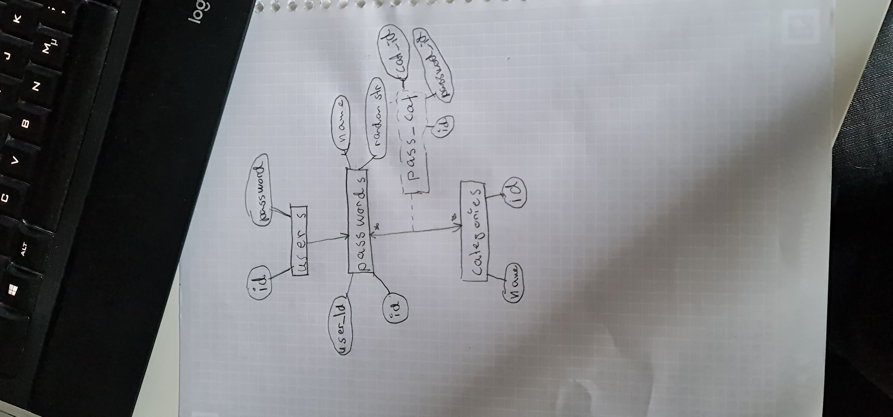

# Projektplan

## 1. Projektbeskrivning (Beskriv vad sidan ska kunna göra).

Lösenordshanterare och genererare
    1. Logga in på ditt konto --> Kopplat till din dator så laddar ner programmet och skapar ett lösenord till den datorn
    2. Lägger till kategori --> Ett slumpat ord
    3. Inom kategorin finns det olika typer av lösenord --> Ex. för db. Mail. eller liknande
    4. Ska gå att komma åt lösenorden --> skapa om lösenordet dvs få ett nytt

    Alla lösenord ska bestå av förska 2 bokstäverna av kategorin, --> Vill ha ord med 2st olika kombinationer av saker, typ A med a-ö som går osv
    Lösenordet ska ha lite randomisering, men uppbyggd något i stil med 
    [kategori][spec. lösenord][random][signatur för dig] 
    --> finns på alla; Timestamp?

    Så på något sätt ska allt vara låst i db och informationen är bara tillgänglig med en 6-siffrig kod som man skriver in när man ska använda den

## 2. Vyer (visa bildskisser på dina sidor).

## 3. Databas med ER-diagram (Bild på ER-diagram).

    

## 4. Arkitektur (Beskriv filer och mappar - vad gör/innehåller de?).

